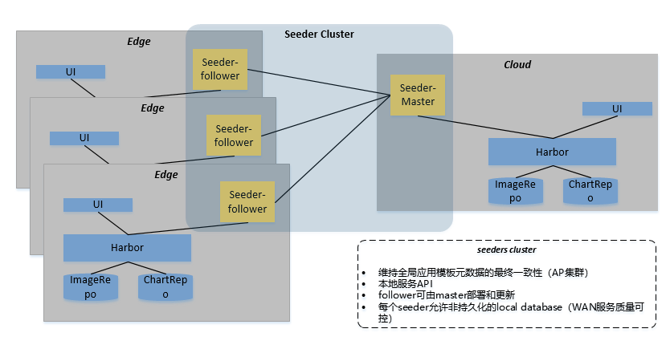

# seeder

# Architecture

# Usage
Usage of ./seeder:
    -advertise-addr string
        addr for advertise. (default "10.12.103.89")
    -alsologtostderr
        log to standard error as well as files
    -db-addr string
        database connection url. (default "172.16.24.103:3306")
    -db-name string
        database name to use. (default "seeder")
    -db-password string
        database login password. (default "password")
    -db-user string
        database login name. (default "root")
    -init-db
        if need init database. (default true)
    -log_backtrace_at value
        when logging hits line file:N, emit a stack trace
    -log_dir string
        If non-empty, write log files in this directory
    -logtostderr
        log to standard error instead of files
    -master-addr string
        master addr
    -node-name string
        seeder node name. (default "edge-node-pc")
    -repo-addr string
        addr for repo. (default "http://172.16.24.103")
    -role string
        seeder role. (default "follower")
    -stderrthreshold value
        logs at or above this threshold go to stderr
    -use-nat
        if use nat access.
    -v value
        log level for V logs
    -vmodule value
        comma-separated list of pattern=N settings for file-filtered logging
